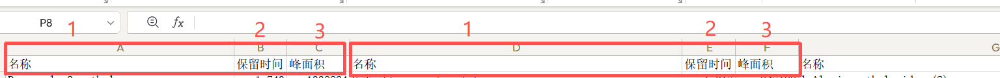
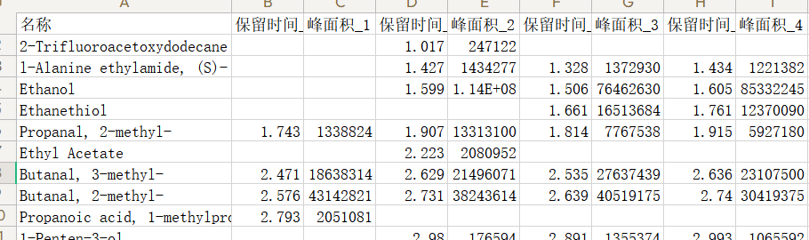
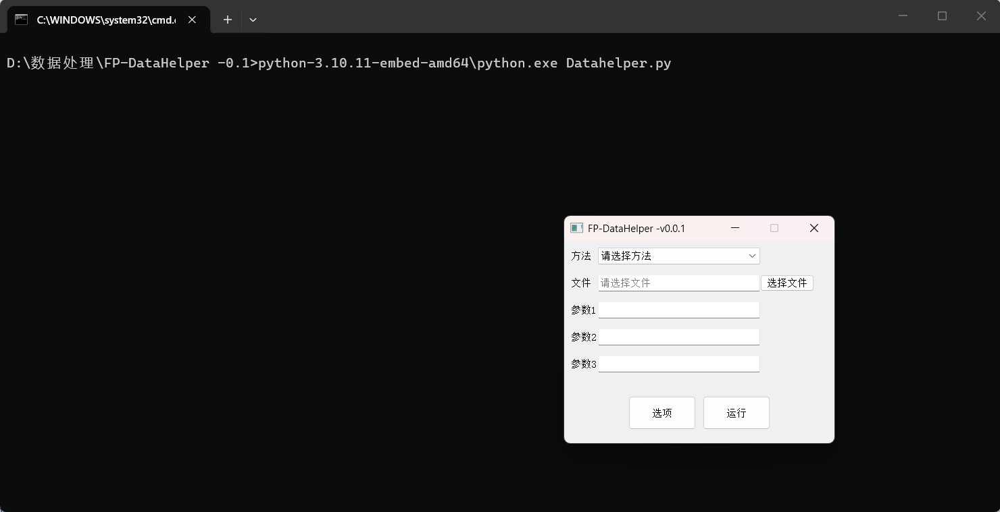

# FP-DataHelper
version: 0.1.2
## 数据整理
待处理文件须按一定的要求编辑后方可进行处理，可按照下文中的要求或参考 [example.xlsx](./example.xlsx) 的样式编辑
### 自动分组
0.1.0版本已实现根据表头自动判断各组数据，在表头标注“时间”、“名称”等内容，即可自动分组，无需手动指定各组。

* 如图所示，程序会根据两个“时间”列之间的距离自动判断各组的列数，表格须保持各组列数相等，如图中各组均为3列。
* “时间”列用于排序，“名称”列用于判断是否为同一物质。须保证每组内各有一列“时间”和“名称”，“时间”和“名称”的顺序没有要求，若识别失败，请将“时间”列置于“名称”之前。
* 若表头上方有其他内容，程序不会进行处理，将按照原样保留在输出的文件内。
### 手动分组
若自动分组失败，则需手动指定每组列数。要求“时间”列置于“名称”列之前，且所有表均保持该指定的每组列数。
### 名称对齐

如图所示，为便于后续处理，程序会将判断为相同物质的数据合并为同一行，并将“名称”列统一移至第一列。
### 时间阈值
对齐时需要设定时间阈值（单位：min），以避免误将不同物质合并的情况，当两物质的“时间”差异大于该阈值时，程序将不会合并这两个物质。

### 操作方法
双击 `启动.bat`，会打开如下图所示的窗口及命令行界面。

1. 在 `方法` 栏中选择使用的方法，一般选择 `Sorter-0.1.0` 即可。
2. 点击 `选择文件` 按钮选择需要处理的文件。
3. 选择方法后，下方 `参数` 框内会显示所需输入的参数。如 `Sorter-0.1.0` 方法要求输入 [时间阈值](#时间阈值) 及 [每组列数（非必填）](#自动分组)。
4. 点击 `运行` 按钮即可进行处理，处理完成后会在命令行界面显示输出的文件名及路径（一般在 [output](./output) 文件夹内）。

## 嗅觉阈值数据库
0.1.2版本已将《化合物嗅觉阈值汇编》第二版中物质在水中的嗅觉阈值整理成简易数据库，可通过CAS号快速查找物质对应的嗅觉阈值。
* 在 `方法` 栏中选择 `CAS_to_Threshold`，点击 `选择文件` 按钮选择需要处理的文件，点击 `运行` 按钮即可进行处理。
* 程序会自动识别“CAS号”所在列，并在“CAS号”列后添加一列香气属性，若程序未识别到“CAS号”列，请在 `参数1` 框内填写“CAS号”列的位置，以字母表示（如“A”，“B”等）。
* 程序仅能对CAS号进行处理，不支持通过名称搜索，若只有名称，请先使用 [CAS号查询](#附加模块) 模块。
* 程序所用数据库为精简版，仅记录了物质在水中的嗅觉阈值。书中部分物质有多个水中嗅觉阈值，数据库仅存储了年份最新的值，若需要空气中或水中的其它阈值可在 [Database](./Database) 文件夹中查阅原书pdf版本。

## 附加模块
0.1.1版本整合了 [AromaNexus](https://github.com/rastagan-git/AromaNexus) 的部分功能，包括CAS号查询、香气属性查询。如需使用完整功能，请自行部署AromaNexus。
### CAS号查询
根据化合物名称在NIST数据库中查找对应的CAS号。
* 在 `方法` 栏中选择 `Name_to_CAS--AromaNexus`，点击 `选择文件` 按钮选择需要处理的文件，点击 `运行` 按钮即可进行处理。
* 程序会自动识别“名称”所在列，并在“名称”列前添加一列CAS号，若程序未识别到“名称”列，请在 `参数1` 框内填写“名称”列的位置，以字母表示（如“A”，“B”等）。
* 程序在每个sheet中仅能对一列名称进行处理，推荐使用对齐功能进行对齐后再查询CAS号。
* 获取数据过于频繁，会给网站服务器带来太多负担，易导致IP被网站封禁，故程序限制了每个化合物的数据获取速度，约为2秒/个，请耐心等待。
* 处理后的数据中若出现 `Ambiguous/List Found`，说明名字有歧义或者没完全匹配，软件不会帮你进行选择，请自行前往NIST网站搜索确认。
* 若数据中出现 `Not Found`，则该物质名称在数据库中未查询到，请手动检查。
### 香气属性查询
根据化合物CAS号在ChemicalBook网站查找对应的香气属性，包括香气特征、香型，少部分物质可查到香气阈值。
* 在 `方法` 栏中选择 `Cb_Spider--AromaNexus`，点击 `选择文件` 按钮选择需要处理的文件，点击 `运行` 按钮即可进行处理。
* 程序会自动识别“CAS号”所在列，并在“CAS号”列后添加一列香气属性，若程序未识别到“CAS号”列，请在 `参数1` 框内填写“CAS号”列的位置，以字母表示（如“A”，“B”等）。
* 程序仅能对CAS号进行处理，不支持通过名称搜索。
* 获取数据过于频繁，会给网站服务器带来太多负担，易导致IP被网站封禁，故程序限制了每个化合物的数据获取速度，约为3秒/个，请耐心等待。
* 程序在搜索时会打开`Chrome浏览器`，请确保电脑中有该浏览器，其它浏览器不保证能用。
* 每隔一段时间网站会要求进行人机验证，此时程序会暂停，请手动完成验证后在程序内回车继续。
* 程序运行时可能会出现搜索失败的情况，程序不会自动重试，请根据实际情况在程序中回车重试或输入`n`并回车直接跳过该物质。

## 环境要求
`Python3`
安装以下模块：
```
tqdm, PyQt5, openpyxl, beautifulsoup4, requests, pandas, selenium, webdriver_manager
```
* Release中有整合了Python3.10及全部所需模块的一键包，可以直接使用。

## 更新日志
### 2026.07.21 v0.1.2
* 新增 [嗅觉阈值查询](#嗅觉阈值数据库) 功能。

### 2026.07.20 v0.1.1
* 整合 `CAS号查询`、`香气属性查询` 功能于[附加模块](#附加模块)。

### 2026.07.10 v0.1.0
* 对底层架构进行调整，理论上可处理列数无限制。
* 支持自动识别并分组。
* 名称统一至同一列。
* 新增进度条，可看到处理进度及剩余时间。

### 2025.08.20 v0.0.2
* 将可处理列数增加至150列。

### 2025.07.01 v0.0.1
* 程序完成。
