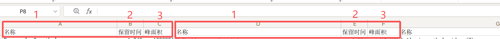
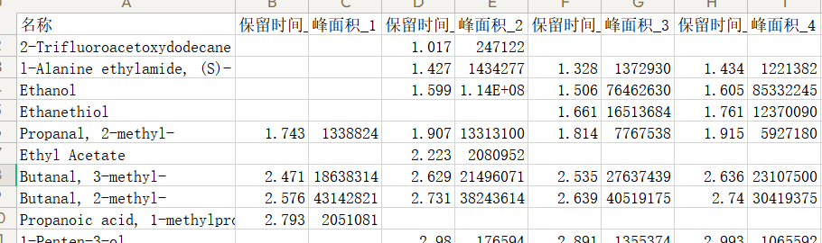

# FP-DataHelper
**version: 0.2.0**

---

## 快速开始

1. 双击 `启动.bat` 打开程序
2. 在 `方法` 栏选择所需功能
3. 点击 `选择文件` 按钮选择待处理的 `.xlsx` 文件
4. 根据提示填写参数（可选）
5. 点击 `运行` 按钮开始处理
6. 处理完成后，输出文件保存在 [output](./output) 文件夹内


---

## 功能一览

| 分类 | 方法 | 功能 |
|------|------|------|
| 主程序 | **Sorter-0.1.0** | 多组色谱数据对齐排序 |
| 扩展模块 | **CAS_to_Threshold** | 根据 CAS 号查询嗅觉阈值 |
| 扩展模块 | **Threshold_Full** | 根据 CAS 号/名称查询嗅觉阈值（完整库，支持多种筛选模式） |
| 扩展模块 | **RI_Calculator** | 计算保留指数（Kovats/线性） |
| 扩展模块 | **Si_Marker** | 标记含硅化合物 |
| 移植内容 | **Name_to_CAS--AromaNexus** | 根据化合物名称查询 CAS 号 |
| 移植内容 | **Cb_Spider--AromaNexus** | 根据 CAS 号查询香气属性 |

---

## 主程序

### 数据整理

待处理文件须按一定的要求编辑后方可进行处理，可按照下文中的要求或参考 [example.xlsx](./example.xlsx) 的样式编辑。

#### 自动分组

目前已实现根据表头自动判断各组数据，在表头标注"时间"、"名称"等内容，即可自动分组，无需手动指定各组。



- 如图所示，程序会根据两个“时间”列之间的距离自动判断各组的列数，表格须保持各组列数相等，如图中各组均为3列
- “时间”列用于排序，“名称”列用于判断是否为同一物质。须保证每组内各有一列“时间”和“名称”，“时间”和“名称”的顺序没有要求，若识别失败，请将“时间”列置于“名称”之前。
- 若表头上方有其他内容，程序不会进行处理，将按照原样保留在输出的文件内。

#### 手动分组

若自动分组失败，则需手动指定每组列数。要求"时间"列置于"名称"列之前，且所有表均保持该指定的每组列数。

#### 名称对齐



如图所示，为便于后续处理，程序会将判断为相同物质的数据合并为同一行，并将“名称”列统一移至第一列。

#### 时间阈值

对齐时需要设定时间阈值（单位：min），以避免误将不同物质合并的情况，当两物质的"时间"差异大于该阈值时，程序将不会合并这两个物质。

#### 参数说明

- 参数1：（必填）时间偏差阈值
- 参数2：（可选）每组数据列数

---

## 扩展模块

### 嗅觉阈值查询

已将《化合物嗅觉阈值汇编》（第二版，科学出版社）中物质在水中的嗅觉阈值整理成简易数据库，可通过CAS号快速查找物质对应的嗅觉阈值。

- 在 `方法` 栏中选择 `CAS_to_Threshold`，点击 `选择文件` 按钮选择需要处理的文件，点击 `运行` 按钮即可进行处理。
- 程序会自动识别"CAS号"所在列，并在"CAS号"列后添加一列嗅觉阈值，若程序未识别到"CAS号"列，请在 `参数1` 框内填写"CAS号"列的位置，以字母表示（如"A"，"B"等）。
- 程序仅能对CAS号进行处理，不支持通过名称搜索，若只有名称，请先使用 [CAS号查询](#cas号查询) 模块。
- 程序所用数据库为精简版，仅记录了物质在水中的嗅觉阈值。书中部分物质有多个水中嗅觉阈值，数据库仅存储了年份最新的值，若需要空气中或水中的其它阈值可查阅原书。

#### 参数说明

- 参数1：（可选）CAS号列位置

---

### 嗅觉阈值查询（增强）

基于完整版水中阈值数据库（《化合物嗅觉阈值汇编》第二版）的高级查询功能，支持更丰富的数据和灵活的筛选模式。数据库包含 1771 个化合物，每个化合物记录了多条阈值数据（包括值、单位、研究者、年份、类型等信息）。

* 在 `方法` 栏中选择 `Threshold_Full`，点击 `选择文件` 按钮选择需要处理的文件，点击 `运行` 按钮即可进行处理。
* 程序支持三种运行模式：
  * **默认模式**（`d`）：自动取每个化合物最新年份的阈值
  * **自定义模式**（`c`）：弹窗选择匹配方式（CAS号/名称）、阈值选择（最新值/最大值/最小值）、类型筛选（全部/detection/recognition）
  * **手动模式**（`m`）：弹窗选择匹配方式后，对每个化合物逐行弹出选择窗口，可手动选择要使用的阈值记录
* 程序会自动识别"CAS号"和"名称"列，若未识别到，请在 `参数1` 框内填写列字母。
* 匹配到的阈值单位统一为 mg/L。

#### 参数说明

- 参数1：（可选）CAS号列位置
- 参数2：（可选）运行模式（默认 `d`）
  - `d`：默认模式，取最新阈值
  - `c`：自定义模式，弹窗设置筛选条件
  - `m`：手动模式，逐行选择阈值记录

---

### 保留指数计算

根据正构烷烃参考数据计算保留指数（RI），支持 Kovats 对数插值和线性插值两种公式，可选查询 NIST 数据库进行对比。

#### 参数说明

- 参数1：（必填）正构烷烃参考文件路径（.xlsx，两列：碳数、保留时间，参考 [exampleRI.xlsx](exampleRI.xlsx) ），可点击输入框右侧 `...` 按钮选择文件
- 参数2：（可选）公式,聚合方式（默认 `L,A`）
  - `公式` 即保留指数的计算公式，支持对数插值及线性插值，默认线性插值。`L`=线性，`K`=Kovats，`B`=两者
  - `聚合方式` 即用于计算化合物RI的保留时间选择方式，程序提供三种选项，默认为取平均时间。`A`=平均，`MIN`=最小，`MAX`=最大

- 参数3：（可选）CAS列,名称列（默认自动识别）

计算完成后，程序会询问是否查询 NIST 数据库（查询方式参考 [CAS号查询](#cas号查询) ）。

---

### 含硅化合物标记

许多自然中不存在含硅化合物，因此在一些领域中，检测到的含硅物质需要作为杂质排除。程序能够扫描化合物名称，将含硅物质的名称单元格字体改为红色。

**识别关键词：** silane, siloxane, silicone, silicon, silyl, trimethylsilyl, dimethylsilyl, disiloxane, trisiloxane, polysiloxane 等。

#### 参数说明

- 参数1：（可选）名称列位置

---

## 移植内容

本程序整合了 [AromaNexus](https://github.com/rastagan-git/AromaNexus) 的部分功能，包括CAS号查询、香气属性查询。如需使用完整功能，请自行部署AromaNexus。

### CAS号查询

根据化合物名称在NIST数据库中查找对应的CAS号。

- 在 `方法` 栏中选择 `Name_to_CAS--AromaNexus`，点击 `选择文件` 按钮选择需要处理的文件，点击 `运行` 按钮即可进行处理。
- 程序会自动识别"名称"所在列，并在"名称"列前添加一列CAS号，若程序未识别到"名称"列，请在 `参数1` 框内填写"名称"列的位置，以字母表示（如"A"，"B"等）。
- 程序在每个sheet中仅能对一列名称进行处理，推荐使用对齐功能进行对齐后再查询CAS号。
- 获取数据过于频繁，会给网站服务器带来太多负担，易导致IP被网站封禁，故程序限制了每个化合物的数据获取速度，约为2秒/个，请耐心等待。
- 处理后的数据中若出现 `Ambiguous/List Found`，说明名字有歧义或者没完全匹配，软件不会帮你进行选择，请自行前往NIST网站搜索确认。
- 若数据中出现 `Not Found`，则该物质名称在数据库中未查询到，请手动检查。

#### 参数说明

- 参数1：（可选）名称列位置

---

### 香气属性查询

根据化合物CAS号在ChemicalBook网站查找对应的香气属性，包括香气特征、香型，少部分物质可查到香气阈值。

- 在 `方法` 栏中选择 `Cb_Spider--AromaNexus`，点击 `选择文件` 按钮选择需要处理的文件，点击 `运行` 按钮即可进行处理。
- 程序会自动识别"CAS号"所在列，并在"CAS号"列后添加一列香气属性，若程序未识别到"CAS号"列，请在 `参数1` 框内填写"CAS号"列的位置，以字母表示（如"A"，"B"等）。
- 程序仅能对CAS号进行处理，不支持通过名称搜索。
- 获取数据过于频繁，会给网站服务器带来太多负担，易导致IP被网站封禁，故程序限制了每个化合物的数据获取速度，约为3秒/个，请耐心等待。
- 程序在搜索时会打开`Chrome浏览器`，请确保电脑中有该浏览器，其它浏览器不保证能用。
- 每隔一段时间网站会要求进行人机验证，此时程序会暂停，请手动完成验证后在程序内回车继续。
- 程序运行时可能会出现搜索失败的情况，程序不会自动重试，请根据实际情况在程序中回车重试或输入`n`并回车直接跳过该物质。

#### 参数说明

- 参数1：（可选）CAS号列位置

---

## 环境要求

- **Python 3**（推荐 3.10+）
- 依赖模块：
  ```
  tqdm, PyQt5, openpyxl, beautifulsoup4, requests, pandas, selenium, webdriver_manager
  ```
- Release 中提供整合了 Python 3.10 及全部依赖的一键包，可直接使用
- 使用 `Cb_Spider--AromaNexus` 方法需安装 Chrome 浏览器

---

## 更新日志

### 2026.08.26 v0.2.0
* 新增 [嗅觉阈值查询（增强）](#嗅觉阈值查询（增强）) 功能（Threshold_Full）
* 主程序架构调整，提高GUI美观度

### 2026.07.28 v0.1.3
* 新增 [保留指数计算](#保留指数计算)、[含硅化合物标记](#含硅化合物标记) 功能

### 2026.07.21 v0.1.2
* 新增 [嗅觉阈值查询](#嗅觉阈值查询) 功能

### 2026.07.20 v0.1.1
* 整合 [CAS号查询、香气属性查询](#移植内容) 功能

### 2026.07.10 v0.1.0
* 底层架构调整，理论上可处理列数无限制
* 支持自动识别并分组
* 名称统一至同一列
* 新增进度条

### 2025.08.20 v0.0.2
* 可处理列数增加至 150 列

### 2025.07.01 v0.0.1
* 程序完成
